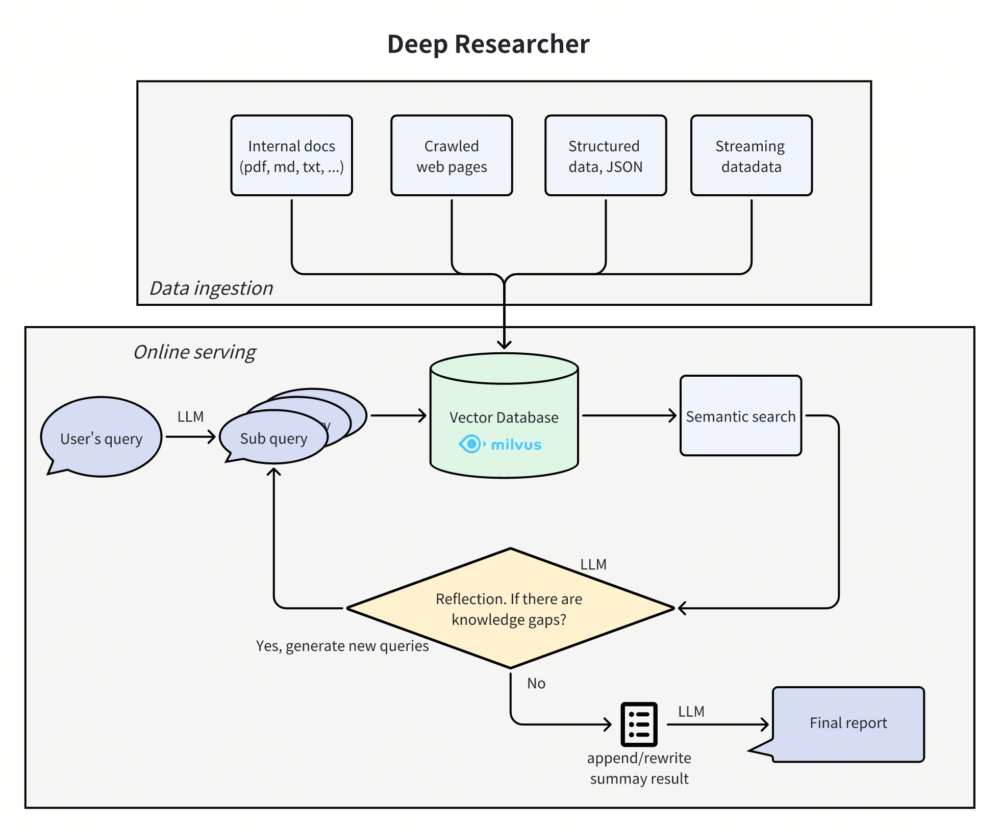
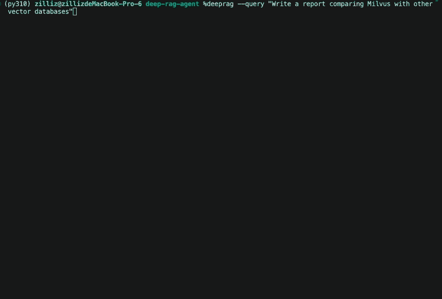

# DeepSearcher

DeepSearcher combines powerful LLMs (DeepSeek, OpenAI, etc.) and Vector Databases (Milvus, etc.) to perform search, evaluation, and reasoning based on private data, providing highly accurate answer and comprehensive report. This project is suitable for enterprise knowledge management, intelligent Q&A systems, and information retrieval scenarios.



## 🚀 Features

- **Private Data Search**: Maximizes the utilization of enterprise internal data while ensuring data security. When necessary, it can integrate online content for more accurate answers.
- **Vector Database Management**: Supports Milvus and other vector databases, allowing data partitioning for efficient retrieval.
- **Flexible Embedding Options**: Compatible with multiple embedding models for optimal selection.
- **Multiple LLM Support**: Supports DeepSeek, OpenAI, and other large models for intelligent Q&A and content generation.
- **Document Loader**: Supports local file loading, with web crawling capabilities under development.

---

## 🎉 Demo



## 📖 Quick Start

### Installation
Install DeepSearcher using pip:
```bash
# Clone the repository
git clone https://github.com/zilliztech/deep-searcher.git

# Recommended: Create a Python virtual environment
cd deep-searcher
python3 -m venv .venv
source .venv/bin/activate

# Install dependencies
pip install -e .
```
Prepare your `OPENAI_API_KEY` in your environment variables. If you change the LLM in the configuration, make sure to prepare the corresponding API key.

### Quick start demo
```python
from deepsearcher.configuration import Configuration, init_config
from deepsearcher.online_query import query

config = Configuration()

# Customize your config here,
# more configuration see the Configuration Details section below.
config.set_provider_config("llm", "OpenAI", {"model": "gpt-4o-mini"})
init_config(config = config)

# Load your local data
from deepsearcher.offline_loading import load_from_local_files
load_from_local_files(paths_or_directory=your_local_path)

# (Optional) Load from web crawling (`FIRECRAWL_API_KEY` env variable required)
from deepsearcher.offline_loading import load_from_website
load_from_website(urls=website_url)

# Query
result = query("Write a report about xxx.") # Your question here
```
### Configuration Details:
#### LLM Configuration

  <pre><code>config.set_provider_config("llm", "(LLMName)", "(Arguments dict)")</code></pre>
<p>The "LLMName" can be one of the following: ["DeepSeek", "OpenAI", "SiliconFlow", "TogetherAI"]</p>
<p> The "Arguments dict" is a dictionary that contains the necessary arguments for the LLM class.</p>

<details>
  <summary>Example (OpenAI)</summary>
    <pre><code>config.set_provider_config("llm", "OpenAI", {"model": "gpt-4o"})</code></pre>
    <p> More details about OpenAI models: https://platform.openai.com/docs/models </p>
</details>

<details>
  <summary>Example (DeepSeek from official)</summary>
    <pre><code>config.set_provider_config("llm", "DeepSeek", {"model": "deepseek-chat"})</code></pre>
    <p> More details about DeepSeek: https://api-docs.deepseek.com/ </p>
</details>

<details>
  <summary>Example (DeepSeek from SiliconFlow)</summary>
    <pre><code>config.set_provider_config("llm", "SiliconFlow", {"model": "deepseek-ai/DeepSeek-V3"})</code></pre>
    <p> More details about SiliconFlow: https://docs.siliconflow.cn/quickstart </p>
</details>

<details>
  <summary>Example (DeepSeek from TogetherAI)</summary>
    <pre><code>config.set_provider_config("llm", "TogetherAI", {"model": "deepseek-ai/DeepSeek-V3"})</code></pre>
    <p> You need to install together before running, execute: <code>pip install together</code>. More details about TogetherAI: https://www.together.ai/ </p>
</details>

#### Embedding Model Configuration
<pre><code>config.set_provider_config("embedding", "(EmbeddingModelName)", "(Arguments dict)")</code></pre>
<p>The "EmbeddingModelName" can be one of the following: ["MilvusEmbedding", "OpenAIEmbedding", "VoyageEmbedding"]</p>
<p> The "Arguments dict" is a dictionary that contains the necessary arguments for the embedding model class.</p>

<details>
  <summary>Example (Pymilvus built-in embedding model)</summary>
    <pre><code>config.set_provider_config("embedding", "MilvusEmbedding", {"model": "BAAI/bge-base-en-v1.5"})</code></pre>
    <p> More details about Pymilvus: https://milvus.io/docs/embeddings.md </p>
</details>

<details>
  <summary>Example (OpenAI embedding)</summary>
    <pre><code>config.set_provider_config("embedding", "OpenAIEmbedding", {"model": "text-embedding-3-small"})</code></pre>
    <p> More details about OpenAI models: https://platform.openai.com/docs/guides/embeddings/use-cases </p>
</details>

<details>
  <summary>Example (VoyageAI embedding)</summary>
    <pre><code>config.set_provider_config("embedding", "VoyageEmbedding", {"model": "voyage-3"})</code></pre>
    <p> You need to install voyageai before running, execute: <code>pip install voyageai</code>. More details about VoyageAI: https://docs.voyageai.com/embeddings/ </p>
</details>

<details>
  <summary>Example (Amazon Bedrock embedding)</summary>
  <pre><code>config.set_provider_config("embedding", "BedrockEmbedding", {"model": "amazon.titan-embed-text-v2:0"})</code></pre>
  <p> You need to install boto3 before running, execute: <code>pip install boto3</code>. More details about Amazon Bedrock: https://docs.aws.amazon.com/bedrock/ </p>
</details>

#### Vector Database Configuration
<pre><code>config.set_provider_config("vector_db", "(VectorDBName)", "(Arguments dict)")</code></pre>
<p>The "VectorDBName" can be one of the following: ["Milvus"] (Under development)</p>
<p> The "Arguments dict" is a dictionary that contains the necessary arguments for the Vector Database class.</p>

<details>
  <summary>Example (Milvus)</summary>
    <pre><code>config.set_provider_config("vector_db", "Milvus", {"uri": "./milvus.db", "token": ""})</code></pre>
    <p> More details about Milvus Config:</p>
    <ul>
        <li>
            Setting the <code>uri</code> as a local file, e.g. <code>./milvus.db</code>, is the most convenient method, as it automatically utilizes <a href="https://milvus.io/docs/milvus_lite.md" target="_blank">Milvus Lite</a> to store all data in this file.
        </li>
    </ul>
    <ul>
      <li>
          If you have a large-scale dataset, you can set up a more performant Milvus server using 
          <a href="https://milvus.io/docs/quickstart.md" target="_blank">Docker or Kubernetes</a>. 
          In this setup, use the server URI, e.g., <code>http://localhost:19530</code>, as your <code>uri</code>.
        </li>
    </ul>
    <ul>
        <li>
            If you want to use <a href="https://zilliz.com/cloud" target="_blank">Zilliz Cloud</a>, 
            the fully managed cloud service for Milvus, adjust the <code>uri</code> and <code>token</code> 
            according to the <a href="https://docs.zilliz.com/docs/on-zilliz-cloud-console#free-cluster-details" 
            target="_blank">Public Endpoint and API Key</a> in Zilliz Cloud.
        </li>
    </ul>

</details>

#### File Loader Configuration
<pre><code>config.set_provider_config("file_loader", "(FileLoaderName)", "(Arguments dict)")</code></pre>
<p>The "FileLoaderName" can be one of the following: ["PDFLoader", "TextLoader", "UnstructuredLoader"]</p>
<p> The "Arguments dict" is a dictionary that contains the necessary arguments for the File Loader class.</p>

<details>
  <summary>Example (Unstructured)</summary>
    <p> Make sure you have prepared your Unstructured API KEY and API URL as env variables <code>UNSTRUCTURED_API_KEY</code> and <code>UNSTRUCTURED_API_URL</code>.</p>
    <pre><code>config.set_provider_config("file_loader", "UnstructuredLoader", {})</code></pre>
    <p> Currently supported file types: ["pdf"] (Under development) </p>
    <p> You need to install unstructured-ingest before running, execute: <code>pip install unstructured-ingest</code>. More details about Unstructured: https://docs.unstructured.io/ingestion/overview </p>
</details>

#### Web Crawler Configuration
<pre><code>config.set_provider_config("web_crawler", "(WebCrawlerName)", "(Arguments dict)")</code></pre>
<p>The "WebCrawlerName" can be one of the following: ["FireCrawlCrawler", "Crawl4AICrawler", "JinaCrawler"]</p>
<p> The "Arguments dict" is a dictionary that contains the necessary arguments for the Web Crawler class.</p>

<details>
  <summary>Example (FireCrawl)</summary>
    <p> Make sure you have prepared your FireCrawl API KEY as an env variable <code>FIRECRAWL_API_KEY</code>.</p>
    <pre><code>config.set_provider_config("web_crawler", "FireCrawlCrawler", {})</code></pre>
    <p> More details about FireCrawl: https://docs.firecrawl.dev/introduction </p>
</details>

<details>
  <summary>Example (Crawl4AI)</summary>
    <p> Make sure you have run <code>crawl4ai-setup</code> in your environment.</p>
    <pre><code>config.set_provider_config("web_crawler", "Crawl4AICrawler", {})</code></pre>
    <p> You need to install crawl4ai before running, execute: <code>pip install crawl4ai</code>. More details about Crawl4AI: https://docs.crawl4ai.com/ </p>
</details>

<details>
  <summary>Example (Jina Reader)</summary>
    <p> Make sure you have prepared your Jina Reader API KEY as an env variable <code>JINA_API_TOKEN</code>.</p>
    <pre><code>config.set_provider_config("web_crawler", "JinaCrawler", {})</code></pre>
    <p> More details about Jina Reader: https://jina.ai/reader/ </p>
</details>


### Python CLI Mode
#### Load
```shell
deepsearcher --load "your_local_path_or_url"
```
Example loading from local file:
```shell
deepsearcher --load "/path/to/your/local/file.pdf"
```
Example loading from url (*Set `FIRECRAWL_API_KEY` in your environment variables, see [FireCrawl](https://docs.firecrawl.dev/introduction) for more details*):

```shell
deepsearcher --load "https://www.wikiwand.com/en/articles/DeepSeek"
```

#### Query
```shell
deepsearcher --query "Write a report about xxx."
```

More help information
```shell
deepsearcher --help
```
### Deployment

#### Configure modules

You can configure all arguments by modifying [config.yaml](./config.yaml) to set up your system with default modules.
For example, set your `OPENAI_API_KEY` in the `llm` section of the YAML file.

#### Start service
The main script will run a FastAPI service with default address `localhost:8000`.

```shell
$ python main.py
```

#### Access via browser

You can open url http://localhost:8000/docs in browser to access the web service.
Click on the button "Try it out", it allows you to fill the parameters and directly interact with the API.


---

## ❓ Q&A

**Q1**: 
OSError: We couldn't connect to 'https://huggingface.co' to load this file, couldn't find it in the cached files and it looks like GPTCache/paraphrase-albert-small-v2 is not the path to a directory containing a file named config.json.
Checkout your internet connection or see how to run the library in offline mode at 'https://huggingface.co/docs/transformers/installation#offline-mode'.

**A1**: Access huggingface exception, try adding the following environment variable:
```bash
export HF_ENDPOINT=https://hf-mirror.com
```
---

## 🔧 Module Support

### 🔹 Embedding Models
- [Pymilvus built-in embedding model](https://milvus.io/docs/embeddings.md)
- [OpenAI](https://platform.openai.com/docs/guides/embeddings/use-cases) (`OPENAI_API_KEY` env variable required)
- [VoyageAI](https://docs.voyageai.com/embeddings/) (`VOYAGE_API_KEY` env variable required)

### 🔹 LLM Support
- [DeepSeek](https://api-docs.deepseek.com/) (`DEEPSEEK_API_KEY` env variable required)
- [OpenAI](https://platform.openai.com/docs/models) (`OPENAI_API_KEY` env variable required)
- [SiliconFlow](https://docs.siliconflow.cn/en/userguide/introduction) (`SILICONFLOW_API_KEY` env variable required)
- [TogetherAI](https://docs.together.ai/docs/introduction) (`TOGETHER_API_KEY` env variable required)

### 🔹 Document Loader
- Local File
  - PDF(with txt/md) loader
  - [Unstructured](https://unstructured.io/) (under development) (`UNSTRUCTURED_API_KEY` and `UNSTRUCTURED_URL` env variables required)
- Web Crawler
  - [FireCrawl](https://docs.firecrawl.dev/introduction) (`FIRECRAWL_API_KEY` env variable required)
  - [Jina Reader](https://jina.ai/reader/) (`JINA_API_TOKEN` env variable required)
  - [Crawl4AI](https://docs.crawl4ai.com/) (You should run command `crawl4ai-setup` for the first time)
### 🔹 Vector Database Support
- [Milvus](https://milvus.io/) (the same as [Zilliz](https://www.zilliz.com/))

---

## 📌 Future Plans
- Enhance web crawling functionality
- Support more vector databases (e.g., FAISS...)
- Add support for additional large models
- Provide RESTful API interface (**DONE**)

We welcome contributions! Star & Fork the project and help us build a more powerful DeepSearcher! 🎯